# Какой язык программирования выбрать? — 4 ответа, 17 языков

> *Этот текст является адаптированной и дополненной версии [видеоролика](https://youtu.be/--x_zOWvq5k).*

**Какой язык программирования выбрать для изучения?** Этот вопрос ставит перед собой и окружающими человек, начинающий свой путь в программировании.

Конечно, самое главное выбрать тот язык, который больше понравится и на котором лучше будет получаться. НО чтобы получалось лучше — нужно перед выбором задать себе несколько вопросов. Каких? В этой тексте ответим. Также вы не останетесь без краткого обзора конкретных языков программирования: *JavaScript, Dart, **Python**, Ruby, **Java**, Kotlin, Scala, LISP, Erlang, C#, C, C++, Rust, PHP, **Golang**, Swift, PL/SQL*. Итого 17 штук!

Приятного чтения! LOYTS and Coding.

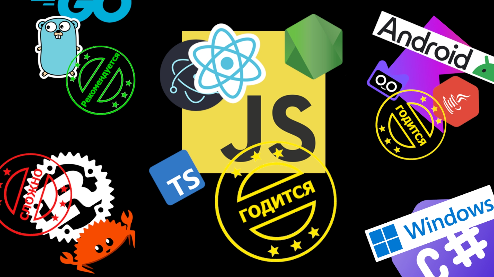

Профессия программист, как правило, является той, которая первой приходит в голову человеку захотевшим почему-то в сферу информационных технологии. Есть ощущение, что для многих уже не секрет чем занимается программист, а те кто сейчас в детском саду об этом знают больше чем 30-летние. Видимо, это заслуга статей (подобных этой) на Teletype 😄  и видеороликов с YouTube.

Раз, секретов нет! — осталось только выбрать язык программирования. Правда, есть подозрение, что между пониманием чем занимается программист и выбором языка, потенциальный программист пропустил **несколько вопросов, которыми следует задаться**.

## Вопрос 1. Есть ли единомышленники?

Когда есть возможность с кем-то пообсуждать или поспорить, спросить или посоревноваться — это даёт хороший прирост к пониманию темы. Поэтому, **если у вас есть друг изучающий язык X, то может вам тоже изучать язык X**? А если таких друзей-единомышленников несколько, это ещё +100500 прироста. 

Наличие коллег по обучению способствует пониманию вашего уровня, и помогает при необходимости подтягиваться.

## Вопрос 2. Какие компании есть в городе?

Хорошо бы начать ходить на собеседования как можно раньше и устроится на работу. За год работы вы скорее всего узнаете больше, чем за несколько лет обучения. 

Обратить внимание на компании в вашем городе или город куда вы сможете поехать — **по каким языкам они предлагают вакансии?**

## Вопрос 3. Как будем практиковаться?

Программирование — это в первую очередь о практике, поэтому вопросом как будете практиковаться при обучении стоит задуматься.

Если на самом начально этапе ещё можно обойтись руководствами, и повторять за ними, то уже дальше, чтобы прогрессировать нужно выходить за эти рамки и делать задачи в которых решения придётся искать. Например, это может быть какой-то собственный проект основанный на вашем хобби или повседневной проблеме, или это может быть чей-то проект к которому вы присоединились. 

**В зависимости от проекта, т.е. от решаемой задачи может быть выбран подходящий язык.**

## Вопрос 4. На каком этап жизни находимся?

Сейчас в ИТ идут не только те, кто только начинает свой профессиональный путь, но и **люди переходящие из других сфер**, которым например, может быть 30 лет, у которых могут быть дети или какая-то другая ответственность. В этом случае, **более целенаправленный и расчётливый подход выбора уместен.**

Что касается тех кто сейчас **в школе, колледже или университете** — вообще не беспокойтесь, у вас достаточно времени, чтобы **попробовать разные языки**, и остановиться на том **который больше понравится** и на котором будет лучше получаться. В вашем возрасте не стоит обращать большого внимание на деньги, выбирайте тот язык от которого вы будете получать наибольшее удовлетворение, остальное приложится.

ВОТ ТАКИЕ ВОПРОСЫ!

У вас может возникнуть мысль, что вообще то есть ещё варианты — окажитесь правы.  Кроме разбора, самих этих 4-х вопросов, хотелось указать на то, **чтобы вы огляделись вокруг и использовали свою стартовую позицию чуть более эффективно.**

Какие ещё вопросы можете предложить?

## Краткий обзор 17 языков программирования

Языки не будут как-то расставлены по места, но по каждому будет указан один стикеров: **РЕКОМЕНДУЕТСЯ**, **ГОДИТСЯ**, **СЛОЖНО** и специальный стикер **ИНТЕРЕСНО**.

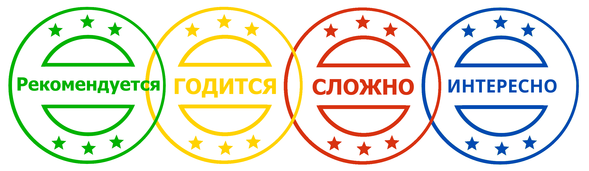

**ИНТЕРЕСНО** добавлен чтобы помечать не самые популярные языки, но о которых хочется рассказать, кроме остальных, можно рассматривать это как бонус. 

### JavaScript

Прежде всего является инструментом в создании пользовательских интерфейсов сайтов и веб-приложении. На чистом JavaScript пишу, но чаще сейчас пользуются расширяющим языком **TypeScript**.

На JavaScript всегда много вакансии в большинстве городов мира, но и программистов на этом языке не мало. Поэтому на рынке труда придётся потолкаться. *Хотя, где сейчас легко?!*

Благодаря гибкости языка, энтузиазма и активности сообщества программистов — JavaScript давно покинул браузер. Он стал использоваться для создания кроссплатформенных приложении для компьютеров и смартфонов, построения бэкенда, и для много ещё чего, но, конечно, подавляюще большой долей остаётся разработка под браузеры.

ГОДИТСЯ

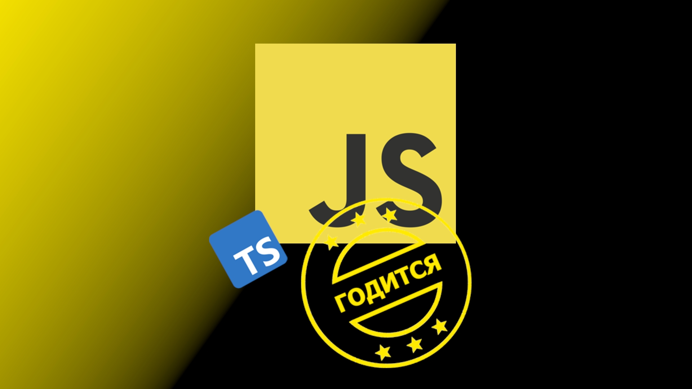

### Dart

Задумывался Google как альтернатива JavaScript в которой будут устранены ошибки последнего.

> *"Javascript имеет фундаментальные недостатки, которые нельзя исправить, просто развивая язык."* - Марк Миллер (исследователь в Google), из оценки развития JavaScript и создания Dart.

Ставилась цель, что кроме трансляции в JavaScript он будет поддержан браузерами. Если коротко, то у Dart не получилось *(TypeScript победил!)*.

Язык уходил в закат, но появился второй шанс — кроссплатформенный фреймворк **Flutter** от Google в котором он основа для написания приложения (видимо в Google решили, что не пропадать же вложенному труду и баблу). По сути, сейчас, это основное применение Dart, достаточно растущее, хотя и с некоторой экспериментальной нотой.

ГОДИТСЯ

### Python

Сейчас очень популярен, во многих рейтингах он занимает ведущие места. Используется для автоматизации всего до чего можно дотянуться, язык науки и машинного обучения, использует для веб-разработки, по-прежнему остается языком создания минимально работающего продукта для стартапов. **Хочется заметить**, что такое широкое применение cильно дробит вакансии, поэтому например, такой позиции как *веб-разработчик на Python* будет не так много как это может показаться.

Python довольно простой для начала. Если вы только знакомитесь с программированием — это хороший вариант.

Python редко используют, как основу для больших проектов из-за динамической типизации и относительной медленности (бывают исключения), но в любом проекте с большой вероятностью найдётся какая-то автоматизация выполненная на нём.

РЕКОМЕНДУЕТСЯ

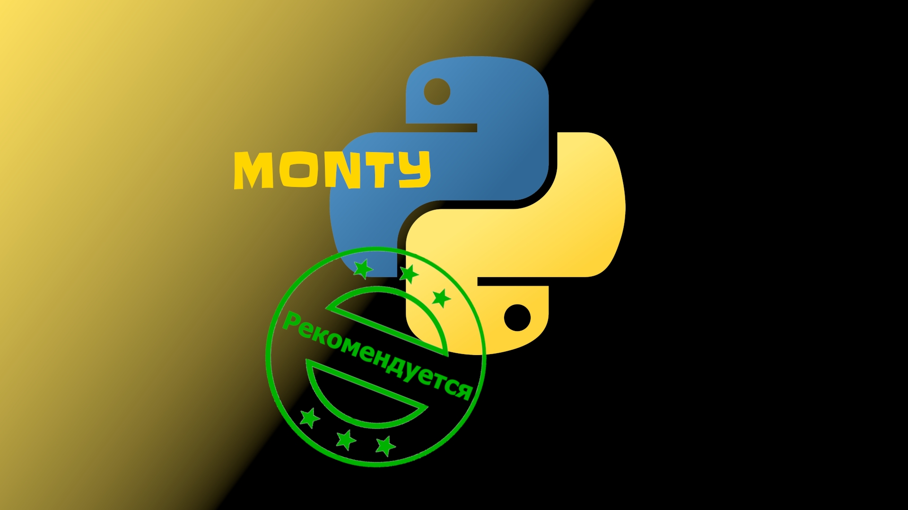

### Ruby

Начнём с того, что Ruby жив, его блеск ещё теплится.

Ruby очень похож на Python, так же является интерпретируемым и динамическим строго типизированным, предъявляется та же претензия: невысокая производительность (проигрывающая Python). В защиту Ruby можно сказать, что это не просто так, это затраты на магию, помогающую создавать продукты быстрее.

Вообще динамические языки удобны для быстрой разработки приложений. У Ruby к этой особенности добавляется помощник — веб-фреймворк Ruby on Rails. Ruby + Ruby on Rails частый выбор стартапов.

Разработка на Ruby основательно прижилась только в веб-разработке.

Программирование на Ruby (Ruby on Rails) - это **fullstack разработка**.

ИНТЕРЕСНО

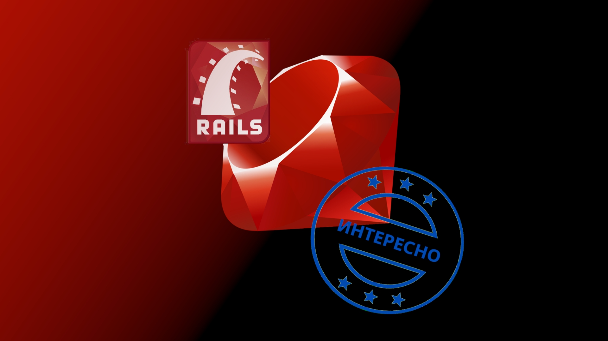

### Java 

Язык больших, безопасных, надёжных систем. Является стандартом для многих сфер, например финтеха.

В языке ответственно соблюдается совместимость с предыдущими версиями языка — это важно для тех сфер в которых используется Java, что-то могло быть написано много лет назад, и оно не должно ломаться при добавлении новых компонентов, на кану так называемая критическая инфраструктура.

Язык имеет большое сообщество программистов, большое количество примеров, материалов для обучение, инструментов для разработки, много вакансии.

Требует сразу начинать разбираться в объектно-ориентированном программировании, что делает несколько сложнее старт новичкам.

В Java по современным мерка, много приходится писать ключевых слов и повторяющихся конструкции.

РЕКОМЕНДУЕТСЯ

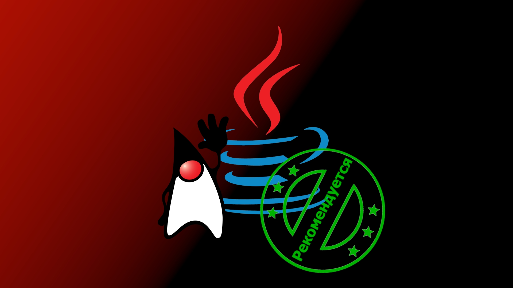

### Kotlin

Kotlin может компилироваться под разные среды выполнения, но первой и основной остаётся среда Java. 

Был период, когда Java сильно отставала от других языков, большую роль в этом сыграла поддерживаемая совместимость версии, которая накладывала ограничения на добавления модного и молодежного в язык. Разработчики Kotlin хотел решить эту проблему. 

Kotlin хорошо встретили в мире **Android**, закончилось всё полной поддержкой от Google. Теперь язык Kotlin основной язык для создания приложении под ОС Android.  Что касается Java на серверной стороне, то тут успехи не такие большие. Пока разрабатывался и набирал обороты Kotlin, Java преодолела ограничения и подтянулась. 

Язык разработан и развивается компанией **JetBrains**, который славится своими инструментами для разработчиков — в этом плане у Kotlin проблем нет.

ГОДИТСЯ

### Scala

Название Scala представляет собой сочетание слов *scalable* (масштабируемость) и *language*. Это отражает главное преимущество языка, он устроен так, что проект на нем можно легко масштабировать.

Scala cочетает возможности функционального и объектно-ориентированного программирования. 

Основная реализация Scala сделана под среду Java (JVM). Доступно взаимодействие со всем, что есть в Java мире. Код на Scala краток и лаконичен. На Scala по сравнению с Java проще реализовывать сложные вещи. Однако читать и писать код сложнее, что создаёт более высокий порог входа и требования к опыту. Как правило на Scala переходят разработчики уже имеющие опыт в Java.

Функциональные языки требуют больше ресурсов из-за своей особенности (неизменяемые объекты, чистые функции), Scala не исключение, так что накиньте памяти и приготовьтесь ждать компиляции.

СЛОЖНО

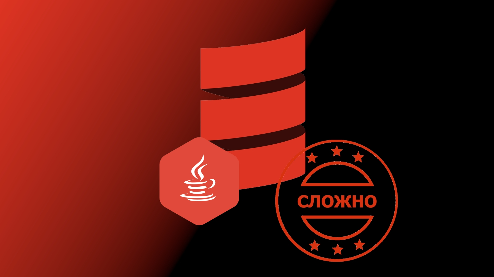

### LISP

Язык уходит корнями в 50-е годы XX века. За прошедшее, до сегодняшних дней, время — это уже не один язык, а целое семейство.

Характерная особенность программ на LISP состоит в том, что всё описывается примитивным синтаксисом. Внешне программы на LISP выглядят как нагромождение скобок. Создавался язык для экспериментов с искусственным интеллектом, отсюда эта примитивность, нужно было добиться обработки программы простейшим кодом, чтобы можно было сделать самомодифицирующиеся программы для адаптации к изменившимся условиям. 

Искусственный интеллект пошёл по пути развития обучения нейросетей, но это LISP пережил — оказался удобен для написания математических ядер, инженерных движков, описания расчётов, взаимодействия с системами автоматизированного проектирования (САПР), обработки данных. Хотя за последнее время в некоторых этих задачах серьезно был потеснён языком Python.

Используется в ведущих университетах мира для преподавания программирования и информатики, ярким примером является курс *Structure and Interpretation
of Computer Programs* от MIT.

ИНТЕРЕСНО

### Erlang

Функциональный язык, предназначенный для создания распределённых вычислительных систем. Разработан и поддерживается компанией **Ericsson**. Имеет фреймворк **Open Telecom Platform (Erlang/OTP)**, содержащий набор библиотек и шаблонов проектирования. 

Программа на Erlang транслируется в байт-код и выполняется в виртуальной машине BEAM. Язык включает в себя средства порождения легковесных процессов (у каждого из которых свой сборщик мусора) и их взаимодействия через обмен асинхронными сообщениями. Erlang-системы позволяют на горячую заменять код без остановки работы, продолжая обрабатывать данные и запросы клиентов.

На платформе Erlang существует ещё один функциональный язык **Elixir**, созданный одним из разработчиков Ruby on Rails для облегчения создания веб-приложении.

ИНТЕРЕСНО

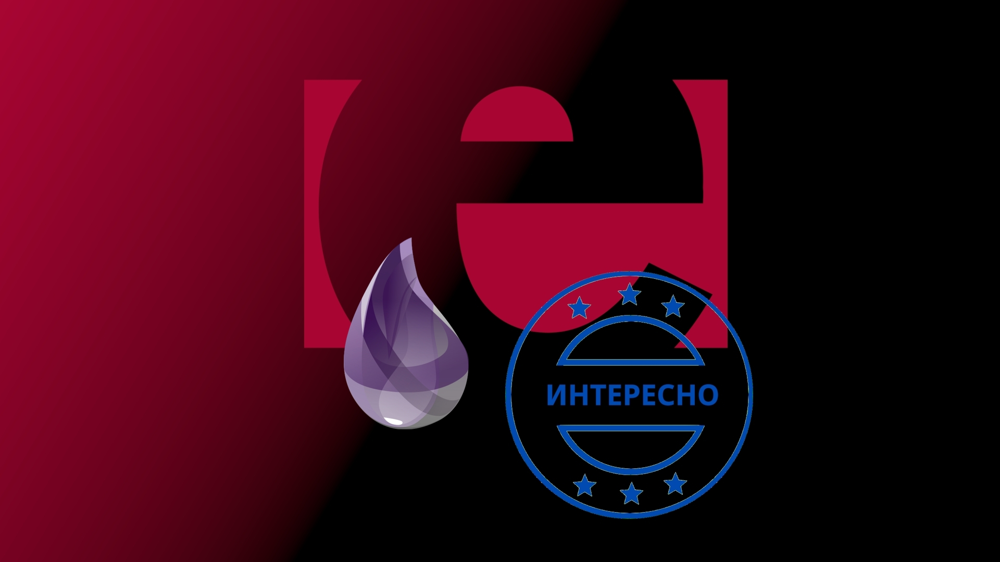

### C#  

Альтернатива Java от компании Microsoft. Будет помоложе Java, поэтому её ошибки постарались учесть, из-за этого C# получился чуть более приятным.

Порог входа, примерно такой же как у Java. Применяется в тех же сферах, что Java, только в меньшем охвате.  

Используется для разработки корпоративных систем, веб-приложении, программ под ОС Windows и игр на движке Unity.

ГОДИТСЯ

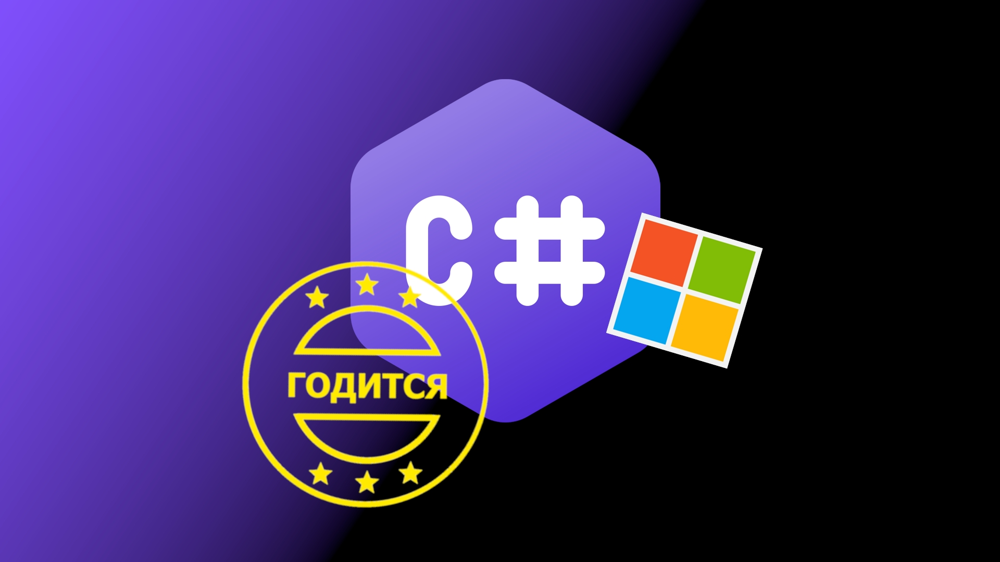

### C

Компактный процедурный язык. 

Используется там где важна каждая крупица память, важно быстродействие. Прежде всего это системное программирование, программирование встраиваемых систем, программирование микроконтроллеров.  

Неплохо подходит для знакомства с программированием, даже можно сказал — полезно с него начинать, вы ближе познакомитесь не только с базовым программированием, но и основами архитектуры компьютера. Но это консервативное мнение.  

Для профессионального пути, конечно, брать его стоит если вы действительно хотите больше взаимодействовать с аппаратной частью вычислительных систем.

ГОДИТСЯ

### C++

Полная противоположность языку С в плане размеров — язык чудовищно большой. Для коммерческой разработки требуется высокая квалификация. Поддерживает множество стилей программирования. Совместим с языком C.

Язык позволяет разрабатывать быстрые программы, но платить за это приходится продолжительностью и сложностью разработки.

Его выбирают тогда, когда действительно не хотят нести накладные расходы и не готовы поступиться производительностью ради более быстрой разработки. Среди таких разработок могут быть:
 * ядра операционных систем и драйвера
 * протоколы
 * поисковые движки
 * игры с хорошей графикой
 * браузеры
 * компиляторы.

СЛОЖНО

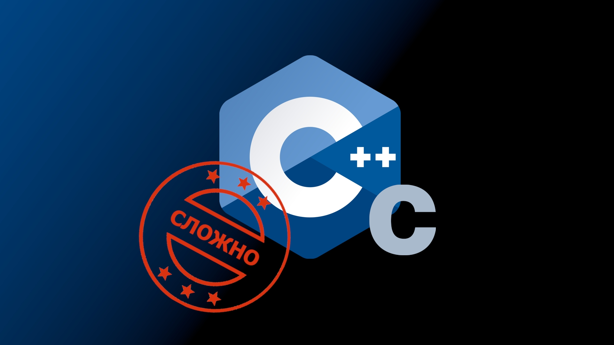

### Rust  

Rust пророчат замену С++. Пока это только перспективы. За время своего долго существования С++, а если точнее его компиляторы, накопили огромные объёмы оптимизации, до которых Rust ещё расти и расти, скажем так — Rust ещё юнец, но подаёт надежды.
  
Так как он целится в смещение языка С++, то ему надо быть быстрым — быстрый.

Хочется отметить официальное руководство, выполненное в виде книги.

Язык пытается снизить планку сложности программирования относительно С++, но всё равно остается довольно сложным.

СЛОЖНО

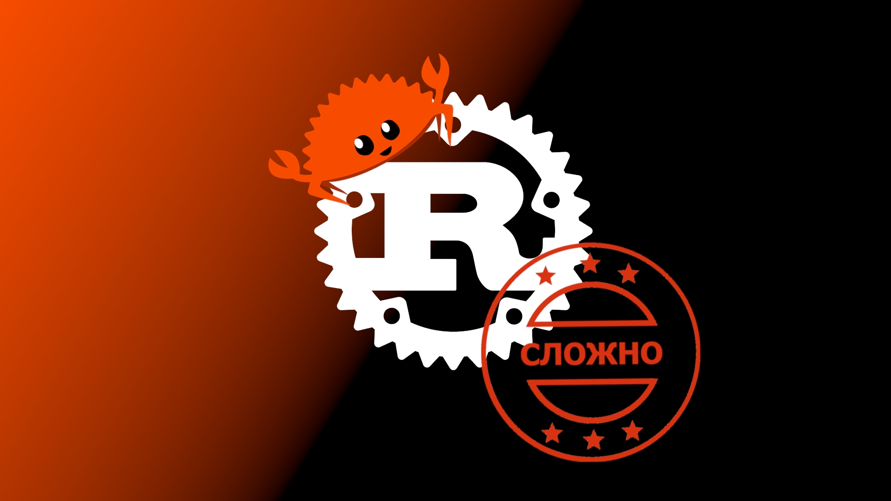

### PHP  

Язык на котором делают сайты и веб-порталы, для этого он и разрабатывался. На нём написано большинство сайтов.

Так как сайтов написано много, нужно их поддерживать и дорабатывать, поэтому здесь много вакансии. Хотя новые проекты начинают всё реже на PHP, но они есть. Главным образом из-за достоинств, которые предлагаются: большая база знании, низкий порог входа в разработку, скорость разработки. Язык ещё долго будет на плаву, но динамика всё таки в негативную сторону. 

ГОДИТСЯ

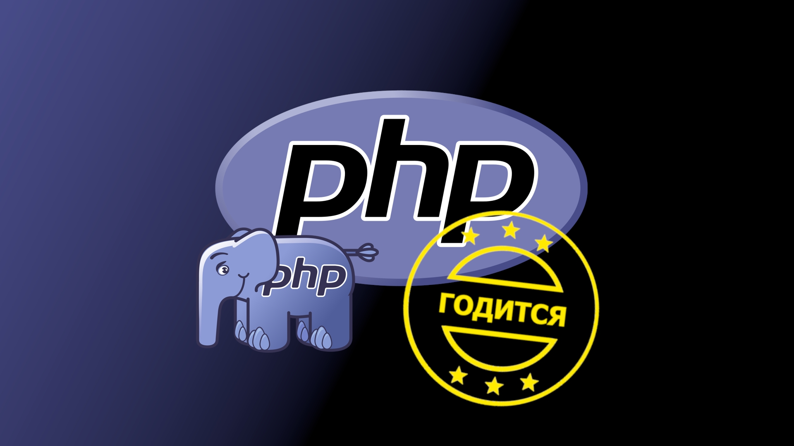

### Golang

Официальное название — **Go**, но с таким ключевым словом в Интернете искаться трудно, поэтому наравне с официальным именем его называют Golang.

Ключевыми идеями языка являются:
- быстрота сборки программ
- устранение появление разнообразия стилей программирования
- удобочитаемость
- скорость работы
- удобство работы с многопоточностью
  
Golang язык со сборщиком мусора, это понижает его скорость относительно C++ и Rust, но не критично для решения поставленных пред ним задач. Замедление может составлять условные 10%, но за то у вас будет меньше болеть голова за безопасность и надёжность, время компиляции и сроки вывода в продакшен.

Язык компактный и довольно быстро изучается, но есть обратная сторона — синтаксис задуман небогатым. Поэтому нужно быть готовым писать много кода и многие вещи реализовывать вручную.

Используется не так широко как Java или Python, у него не такой широкий спектр выполняемых на нём задач. На нём разрабатывают веб-сервисы и инфраструктурные инструменты.

Последнее время отмечается высокий спрос на Go-программистов (в народе гоферы (gopher - суслик)) на рынке труда. Многие компании переписывают (разделяют) веб-сервисы с PHP и Python именно на этот язык.

РЕКОМЕНДУЕТСЯ

### Swift

Современный язык программирования, разработанный компанией **Apple** в первую очередь для разработки приложении под свои устройства. Сам язык открытый (начиная с версии 2.2), и может компилироваться не только под операционные системы Apple, но факту, если искать работу это будет разработка приложении под Apple, в основном под iOS (iPhone).

ГОДИТСЯ

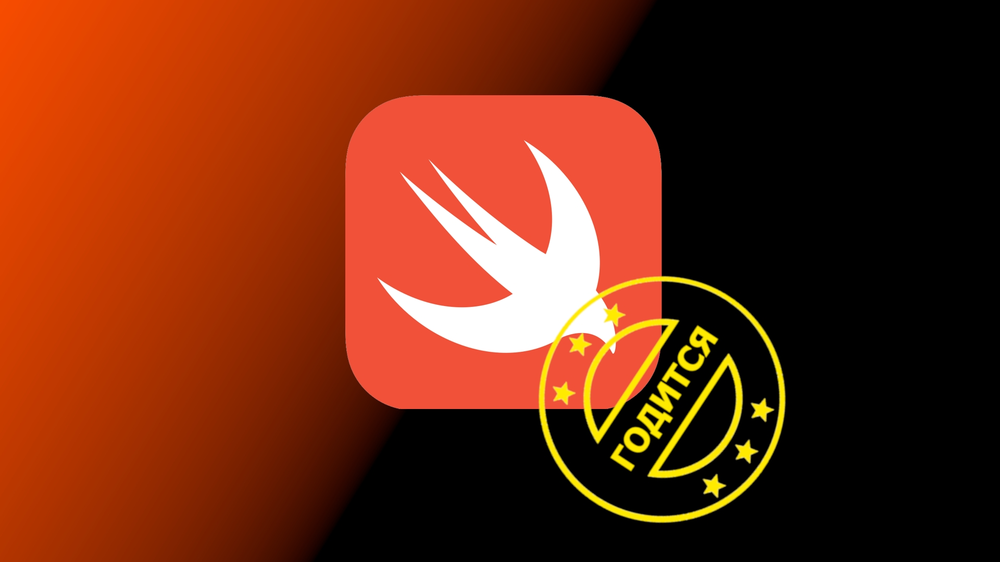

### PL/SQL

Относится к классу встроенных языков. Что имеется ввиду? Это когда язык привязан к какой-то программной системе (как правило большой). PL/SQL встроен в реляционную систему управления базами данных (СУБД) **Oracle Database**. Вместе с Oracle Database широко применяется в больших предприятиях, банках, телекоммуникационных и страховых компаниях.

PL/SQL — процедурное расширение языка SQL, в современных версиях Oracle Database доступна объектно-ориентированная модель. Операторы SQL могут быть легко вызваны непосредственно из PL/SQL.

Благодаря формированию логики на стороне баз данных, можно отказаться от лишней пересылки данных от сервера баз данных к серверу приложения, а полностью или частично подготовить данные внутри базы. Тем самым ускорить работу приложения, сэкономить ресурсы и обеспечить дополнительную безопасность.

ИНТЕРЕСНО

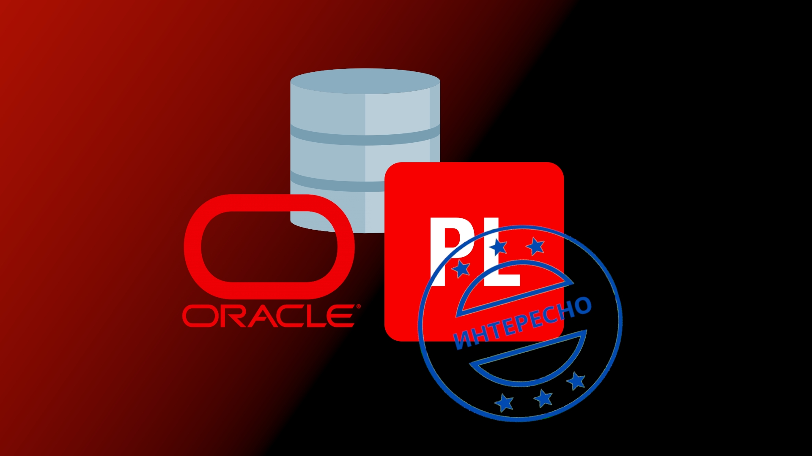

## Итого

- **рассказали** о 4-х вопросах при выборе
- **раскрыли** истинную цель 4-х вопросов
- **рассмотрели** 17 языков программирования

**Спасибо за внимание!** LOYTS and Coding.